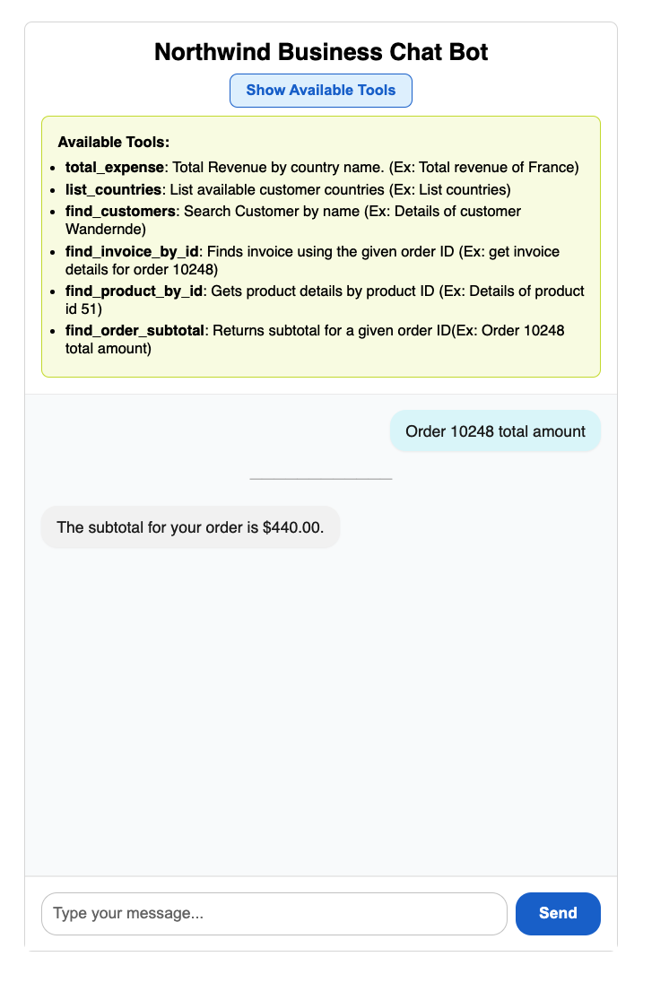

# mcp-chat-bot

An MCP demo chatbot to demonstrate how business users can explore data in the Northwind Database.

This tool includes only a few features for demonstration purposes. You can extend the codebase to add more tools as needed.

## How to Run

### Open two terminals:

Terminal 1: Start the backend app
```
cd src/app
export GEMINI_API_KEY=AIzaSyC.......E2yYwk
uvicorn client:app --reload
```

Terminal 2: Start the web UI

```
cd src/ui
npm run dev
```

Open the UI in your browser
Visit: http://localhost:5173/

## Screenshot



Start asking questions! 😊